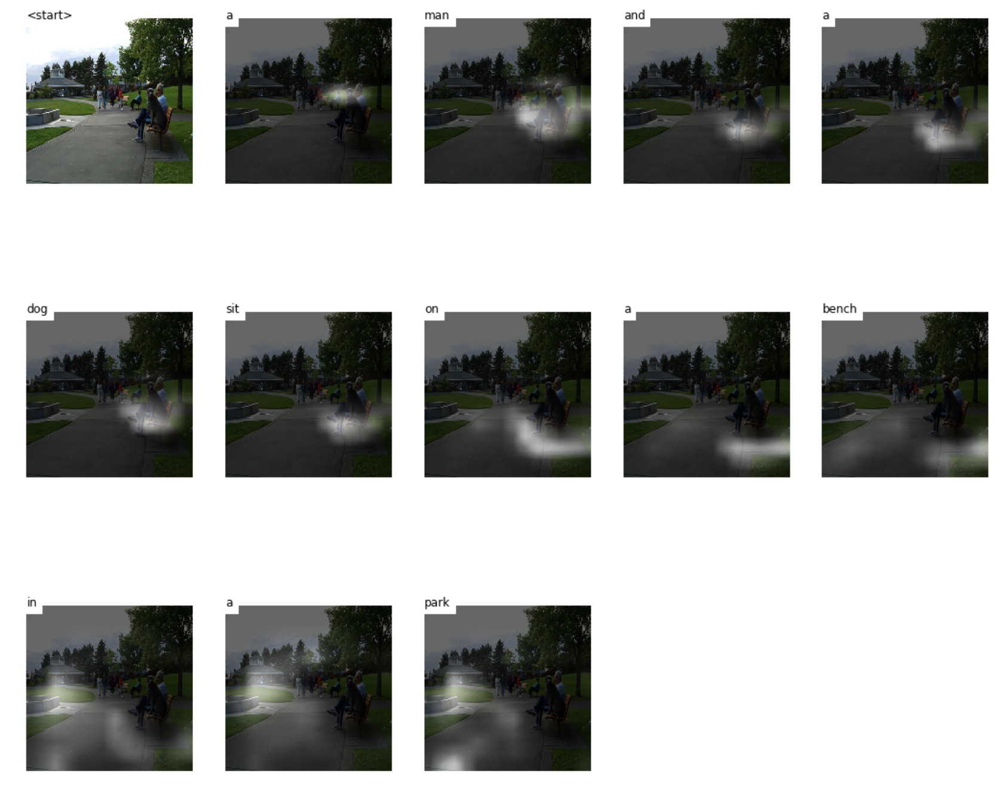
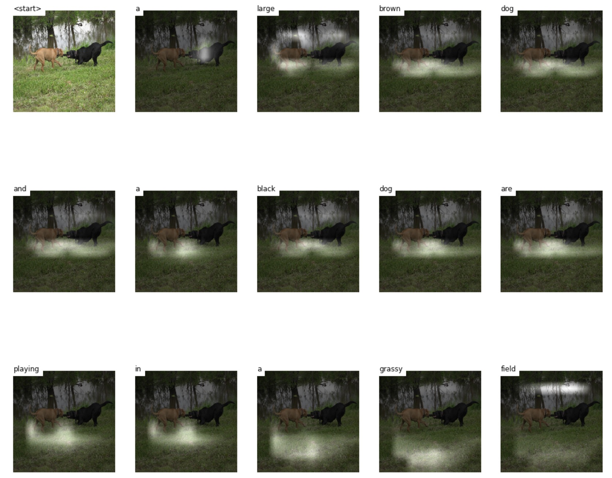
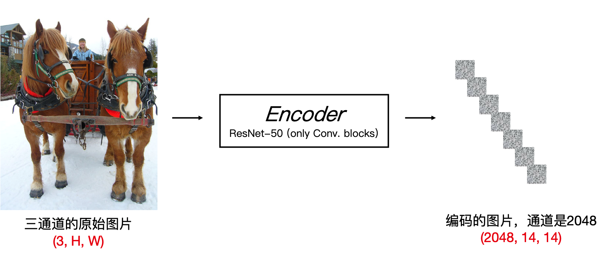
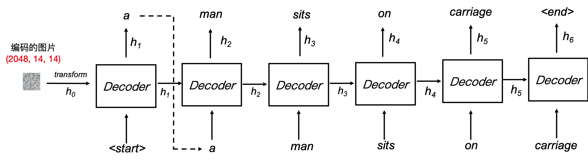
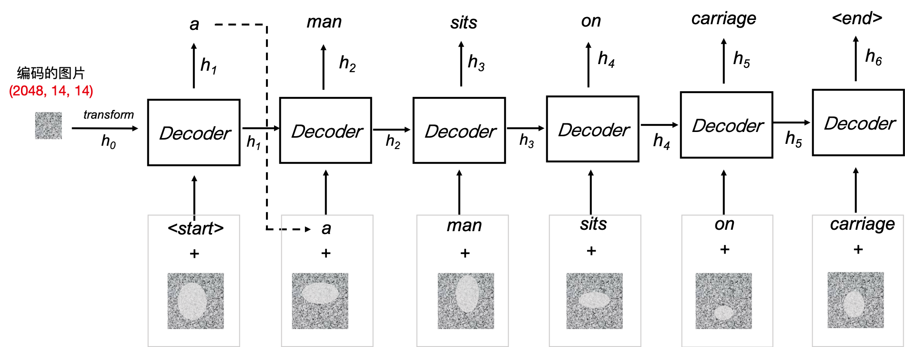
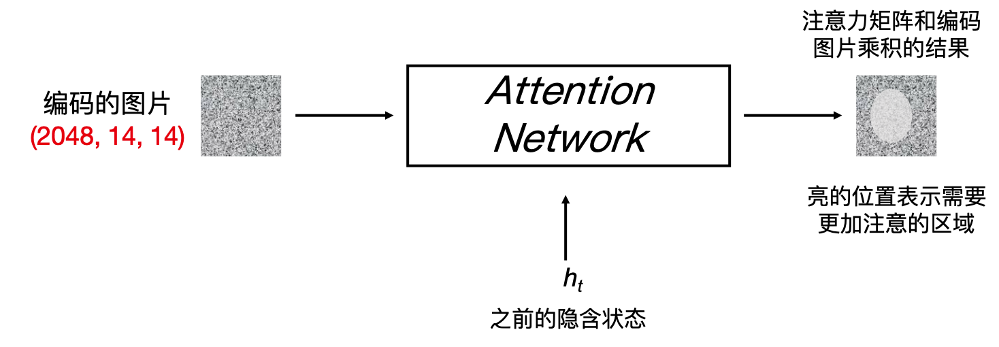
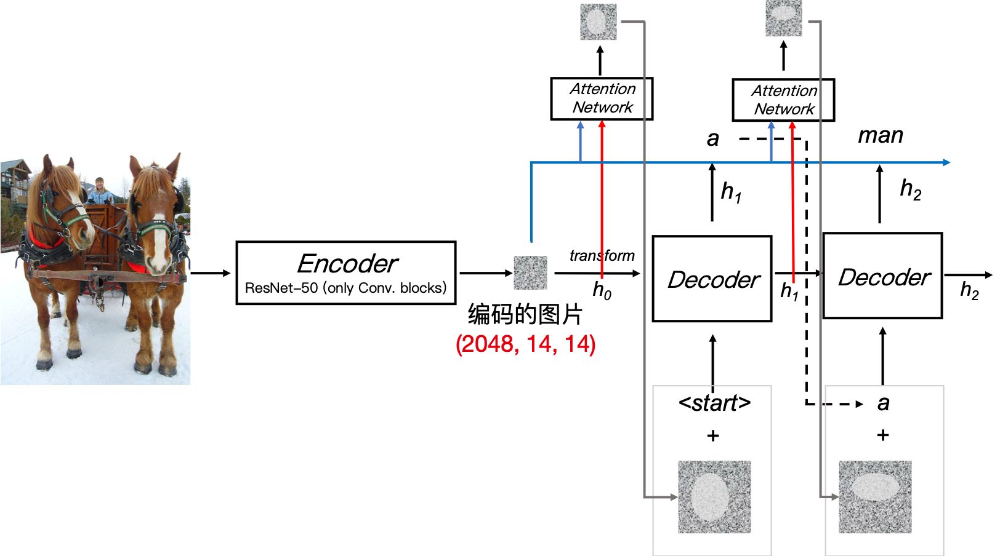
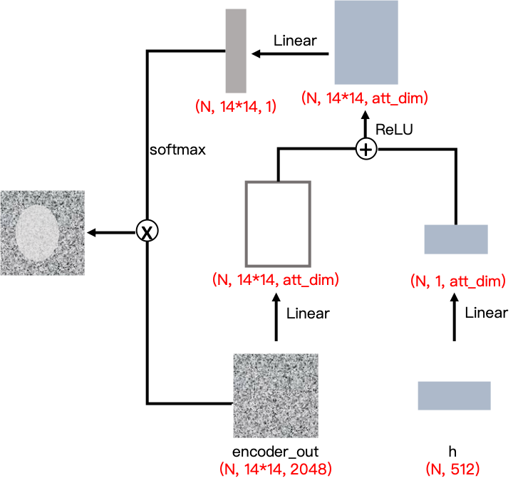
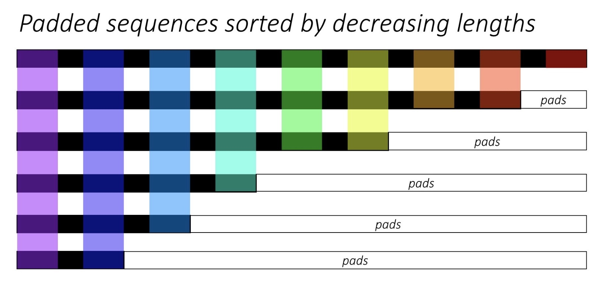
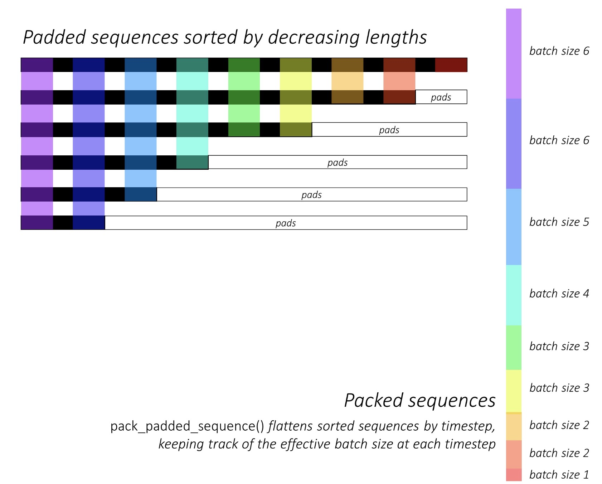

这是一个 [PyTorch](https://pytorch.org/) 的项目: a PyTorch Tutorial to Transfer Learning

这是 [a series of pytorch projects](https://github.com/L1aoXingyu/a-series-of-pytorch-projects) 中的第二个项目，在这个项目中我们会学习到如何使用卷积神经网络和循环神经网络实现给图片加字幕的效果。

需要大家了解 PyTorch 的基本知识，同时要掌握卷积神经网络和循环神经网络的知识。

项目使用 `PyTorch 1.0` 和 `python3.7`

**项目要求**:  
1. 阅读 [Show, Attend, and Tell](https://arxiv.org/abs/1502.03044) 这篇论文
2. 找到代码中 `TODO` 部分，完成代码的内容，并训练网络 (`models.py, train.py and inference.py`)
3. （可选）实现分阶段的训练，第一阶段只训练 `Decoder`，接着将训练好的 `Decoder` 和 `Encoder` 联合在一起进行训练，可以得到更好的结果


# 目录

[**Objective**](https://github.com/tensorinfinitysip/a-PyTorch-Project-to-Image-Caption#objective)

[**Concepts**](https://github.com/tensorinfinitysip/a-PyTorch-Project-to-Image-Caption#concepts)

[**Overview**](https://github.com/tensorinfinitysip/a-PyTorch-Project-to-Image-Caption#overview)

[**Implementation**](https://github.com/tensorinfinitysip/a-PyTorch-Project-to-Image-Caption#implementation)


# Objective

**在这个项目中，我们将使用 CNN 和 RNN 建立一个模型，这个模型可以对一张给定的图片，生成一个该图片的描述字幕。**

为了使整个项目简单且易于实现和教学，我们主要以 [Show, Attend, and Tell](https://arxiv.org/abs/1502.03044) 这篇论文为基础进行算法的实现，所以首先请大家阅读以下这篇论文，虽然这篇论文并不是目前的 state-of-the-art，但是在当时这篇论文仍然引起了非常大的关注，值得我们去学习和实现。作者的原始实现能够从[这里找到](https://github.com/kelvinxu/arctic-captions)。

通过实现论文中的方法，我们可以学会如何使用 CNN 来提取图片特征，同时利用 RNN 来生成文字序列，同时论文中的方法还利用了**注意力机制**，这个机制能够帮助模型学习在生成每个单词的时候，模型应该更加注意图片中的哪些区域。

下面是一些图片和相关生成的描述的例子，通过此项目的练习，最后我们可以达到相似的效果：

<div align='center'>

</div>


<div align='center'>
  
</div>


# Concepts

- **Image captioning**. 这个概念上面已经提及了，就是对一张给定的图片，模型会生成图片相关的描述。 

- **编码器和解码器的结构**. 编码器和解码器我们已经在课程里面学习过了，具体来讲就是通过编码器将输入编码成一个固定形式的 code，然后通过解码器再将改 code 重新解码成需要的形式，这里就是通过 RNN 解码成一个一个的单词，将这些单词组成序列构成具有上下文关系的句子。
- **注意力机制**. 注意力机制目前在深度学习中已经得到了广泛的应用，不管是计算机视觉还是自然语言处理，效果比较好，同时实现也不复杂。除此之外，注意力机制也非常符合人脑的机制，我们在观察任何东西的时候，都会注意到其中重要的部分，这有利于我们抓住重点而忽略一些不重要的部分。在模型中，注意力机制帮助我们的生成每个单词的时候，知道图像中哪些像素更加重要，应该更加关注图片中的哪些位置，这有利于我们生成正确的描述句子。
- **迁移学习**. 这个部分在[该项目](https://github.com/tensorinfinitysip/a-PyTorch-Project-to-Transfer-Learning)中有详细的介绍。


# Overview

在这个部分，我们会根据论文来讲解模型中的每个部分，如果你对这个部分非常熟悉，可以直接跳到[实现](https://github.com/tensorinfinitysip/a-PyTorch-Project-to-Image-Caption#implementation)的部分来完成代码。


## Encoder

在 image caption 中，编码器主要的作用是将一张输入的3通道的图片编码成一个固定格式的 code，这个 code 可以作为原始图片的一个特征表达。

因为是对图片进行编码，当然 CNN 是最好的选择，目前有很多成熟的 CNN 结构可以供我们选择，比如 ResNet，ResNext 等等。

我们需要从头训练编码器吗？答案是否定的，如果你还记得迁移学习的项目，你就知道我们并不需要重新训练，可以使用在 ImageNet 上面预训练的模型，这些预训练的模型在提取图片特征上具有很好的效果。

在这个项目中，为了缩短训练时间，我们选择在 ImageNet 上预训练的50层的 ResNet，我们只需要微调这个部分的参数来进一步提升模型的性能或者是固定这个部分的参数不变，这就是我们之前学习到的迁移学习。 当然我们也鼓励你使用别的预训练模型，比如论文中使用的 VGG，当然使用的模型必须要进行修改，我们会扔掉模型最后的全连接层，因为这些全连接层主要是用来完成分类任务的。

<div align='center'>
  
</div>


这个模型会逐步地对图片提取特征，通过逐渐的卷积和池化操作，图片特征会变得越来越小，通道越来越多，此时提取的特征表达具有语义信息，最后提取的特征一共有2048的维度，大小是 14 x 14，即最后的特征形状是 `2048, 14, 14`。


# Decoder

解码器的主要作用就是**通过编码之后的图片，一步一步来生成一句图像描述**。

因为要生成一段序列，回顾我们学习的知识，使用循环神经网络是一个非常好的选择，这里我们使用 LSTM。

我们首先描述一下不加注意力机制的算法流程，这样比较简单清晰，同时易于理解算法逻辑。首先我们将编码之后的特征做一个全局平均池化，然后通过仿射变换之后作为隐含状态 $h_0$ 输入到 LSTM 当中，然后可以生成一个单词，同时生成下一步的隐含状态 $h_1$，接着该隐含状态和当前预测的单词作为下一次的输入，再一次输入到 LSTM 当中得到下一步的输出，通过不断的生成，直到最后模型输出一个结束标志 `<end>`，我们就终止模型的继续生成。

<div align='center'>
  
</div>


如果使用注意力机制，在序列中生成每一个单词的时候，**模型需要学会每一个单词需要注意图片中的哪一个位置**。例如在生成 `man` 这个单词的时候，模型需要注意到图片中有人的区域。所以加入注意力机制之后，解码器不再是简单的对特征做全局平均，而是先通过一个注意力矩阵和特征相乘，能够让模型知道应该更加注意哪些像素点，然后再输入到解码器里面生成当前的单词。

<div align='center'>
  
</div>


# Attention

上面我们讲了在每一步预测的时候，模型需要使用注意力矩阵和特征相乘，注意力机制就是用了计算这个注意力矩阵的。

我们来思考一下注意力机制到底是如何起作用的，这有助于我们理解算法中的注意力机制是如何计算的。对于一张图片，我们看到之后需要对图片进行描述，当我们描述到某一个单词的时候，比如 `a man` ，那么我们会注意到图片中人的区域，所以这个时候我们更加注意有人区域的像素点，而当描述到 `carriage` 的时候，我们又会注意到有马车的区域，所以每一次当我们要注意某一个区域的时候，我们需要考虑我们的句子描述到了哪里。

上面我们用了一个例子来说明注意力机制是如何起作用的，即每一次我们需要注意图片中那个位置，我们需要通过当前的序列信息来帮助我们，如果用算法来讲，每一次计算注意力矩阵的时候，都需要用 LSTM 的隐含状态，因为这个隐含状态保留了之前句子的信息。

<div align='center'>
  
</div>


这里我们使用 soft attention，也就是我们需要每一步的注意力矩阵所有的元素求和为1，比如在 t 时间步，那么
$$
\sum_{i} A_{i, t} = 1
$$
我们可以使用 `softmax` 来轻松的实现这样一个操作，同时这个也可以作为一个概率的解释，再生成下一个单词的时候，哪个部分被注意到的概率最大。


# Overall

我们将前面讲的所有内容合并在一起，就是整体的网络架构，合并在一起看会更加清晰。


<div align='center'>
  
</div>


下面我们描述一下整体的算法流程：

1. 首先对于一张3通道的输入图片，我们通过编码器得到一个高维的特征表达，然后将这个高维特征表达线性变换为 LSTM 初始化的隐含状态
2. 在每一个时间步
   - 编码的特征表达和前一步的隐含状态一起输入到注意力网络中，计算得到注意力矩阵，然后将编码的特征和注意力矩阵进行加权平均，帮助模型学习到哪些像素点应该更加注意
   - 前一步生成的单词和加权平均的特征表达一起输入到解码器中，生成当前步的输出单词


# Implementation

在下面这个部分，将详细地描述整个项目中的每个部分的具体细节，从数据集的读取到具体算法的实现，最后通过完成代码中的 `TODO` 部分，将能够更加深入地理解整个算法，同时也能锻炼实现算法的能力。


## Dataset

我们可供选择的数据有 MSCOCO’14 Dataset, Flickr30K Dataset 和 Flickr8k Dataset，因为 MSCOCO‘14 Dataset 和 Flickr30k Dataset 数据集太大了，比如 MSCOCO 训练集13G，验证集6G，为了提高我们的模型训练效率，我们决定采用 Flickr8k Dataset，整个数据集只有 1.12G，非常符合该项目的练习目的。数据集可以通过[这里进行下载](http://academictorrents.com/details/9dea07ba660a722ae1008c4c8afdd303b6f6e53b)，其中包含图片的数据集和相对应的描述。

对于图片描述，我们使用 [Andrej Karpathy's training, validation, and test splits](http://cs.stanford.edu/people/karpathy/deepimagesent/caption_datasets.zip)，这个 zip 文件包含着相应的描述句子，该划分被广泛应用。同时你也会在里面发现 MSCOCO’14 Dataset 和 Flickr30k 的划分，如果你想尝试更大的数据集，也可以试试。


## Inputs to model

网络有 3 个输入，第一个是图片，第二个是对应的图片描述，第三个是描述句子的长度。


### 图片输入

我们使用在 ImageNet 上预训练的模型作为 Encoder，对于输入的图片，其 pixel 的范围要在 [0, 1]，同时要用 ImageNet 的均值和方差做标准化

```python
mean = [0.485, 0.456, 0.406]
std = [0.229, 0.224, 0.225]
```

同时我们将会把图片 resize 到 `(256, 256)`，所以最后图片输入是 `Float` 的 `tensor`，形状是 `(N, 3, 256, 256)`，请在 `train.py` 中要求的地方完成数据预处理的代码。


### 图片描述

图片描述就是 decoder 需要生成的目标，其生成的过程是一个单词接一个单词的方式来生成。

为了生成第一个单词，需要一个开始标志，我们使用 `<start>` 来表示这个开始标志，每一个句子都由这个开始标志开始。除了开始标志，我们还需要一个结束标志表明句子已经结束了，这是非常有必要的，有了结束标志，模型在预测的时候就知道此时句子已经结束，这样模型就不会一直生成下去。

```
<start> a man sits on carriage <end>
```

除了开始标志和结束标志之外，我们还需要考虑另外一个因素，就是句子长度。因为我们需要将 `batch` 的数据一起传入网络中，提高模型的训练效率，而不同长度的句子是不能够组成一个矩阵传入到网络中，我们需要的是相同长度的句子，所以我们需要将长的句子截短，将短的句子补长。截短句子非常好理解，就是去掉超过规定长度的部分，那么补长是如何操作呢？我们使用 `<pad>` 对数据进行补长，比如

```bash
<start> a man sits on carriage <end> <pad> <pad> <pad> ...
```

这样我们就可以将不同长度的句子进行统一。

除此之外，对于具体的单词，网络是没有办法读取的，所以需要将单词编码成数字，每一个单词编码成一个唯一的数字，相当于一个唯一的数字对应于一个唯一的单词。在生成数据的过程中，已经创建好了一个单词到数字的映射 `word_map`，这个映射不仅包括所有的单词，还包括我们设定的`<start>, <end>, <pad>` 标志。

```bash
9876, 1, 5, 234, 43, 845, 9877, 0, 0, 0 ...
```

最后我们输入到网络中的字幕是类型为 `Int`  的 `tensor`，形状是 `(N, L)`，其中 `L` 是补全的统一长度。


### 描述句子长度

因为我们将描述的句子全部统一成了相同的长度，所以需要我们追踪每一个句子具体的长度，每个句子的具体长度是实际长度 + 2 (`<start> <end>`)。

句子长度是非常重要的一个元素，因为 `PyTorch` 是动态图的机制，所以每一次我们可以构建不同长度的 `LSTM` 来计算不同长度的句子，而不用浪费计算资源在 `<pad>` 上。

句子长度的输入类型是 `<Int>` ，形状是 `(N,)`。


### Data pipeline

首先需要创建训练集，验证集和测试集，所以运行下面的代码

```bash
python create_input_files.py
```

通过这个代码，会将 Flickr8k Dataset 划分成训练集和验证集，这个代码的具体实现在 `utils.py` 里面，这个部分的代码已经写好，感兴趣的同学可以看看，代码做的事情如下：

- 读入所有的图片，将他们 resize 到 `(256, 256)`，每张图片的形状是 `(3, 256, 256)`，同时将所有的 `ndarray`存入到 3 个 **HDF5** 文件，分别是训练集，验证集和测试集的数据。他们的 pixel 范围是 [0, 255]，类型是 8-bit `Int`。

- 3 个对应的 **JSON** 文件被创建，对应于训练集，验证集和测试集的字幕，这些字幕的顺序和 HDF5 文件中图片的顺序一直。每张图片会保留 5 句字幕，每句字幕都被补长或者截短到 52 的长度，包含 `<start> <end>`。
- 另外3 个对应的 **JSON** 文件被创建，对应于训练集，验证集和测试集的字幕长度。
- 一个单独的 **JSON** 文件被创建，这个文件包含着 `word_map`，即前面提到的单词和数字的编码，这里直接帮我们创建好。

另外一个值得注意的地方是，在保存这些数据之前，有一个参数是 `min_word_freq`，我们设定为 5，这表示当一个单词出现的频率小于 5 次，我们会将其设定为一个 `<unknown>` 字符，这方便我们将不常见的单词统一归为一类。

通过 `datasets.py` 里面的 `CaptionDataset` 类，我们创建了一个读取数据的类，这个类继承于 PyTorch `Dataset`，需要实现 `__len__` 和 `__getitem__` 两个方法。`__len__` 表示整个数据总数，我们定义为所有的字幕总数，`__getitem__` 表示读取对应的图片，字幕以及字幕长度。`CaptionDataset` 的代码已经实现完成，感兴趣的同学可以自行阅读。

**推荐所有的同学运行 explore_data.ipynb 来进行数据的探索，理解上面所说的每个部分。**

最后我们使用 PyTorch 中的 `DataLoader` 来实现多进程的数据读入，将一个 `batch` 的输入传入到网络中进行训练。


### Encoder

编码器的实现代码是 `models.py` 中 `Encoder`。

我们使用预训练的 ResNet-50 作为 backbone 进行特征提取，这个模型已经在 `torchvision` 中提供，因为只需要提取特征，所以我们扔掉最后两层(pooling层和全连接层)。通过 `cnn_ext=list(net.children())` 可以得到网络的所有模块，然后去掉这个 list 的最后两层，接着通过 `nn.Sequential(*cnn_ext)` 就可以建立好特征提取器。

通过前面的特征提取部分，我们可以得到 `(N, 2048, 8, 8)` 的特征，接着我们加上一层 `nn.AdaptiveAvgPool2d()` 将 encoding feature 改变到固定的大小，我们设定的固定大小是 `(14, 14)`。

因为我们想要微调 encoder，所以我们还在 Encoder 中实现了一个方法 `freeze_params()`，通过这个函数可以控制是否要对 encoder 中的参数进行微调，如果需要微调，我们会只微调 ResNet 中 2 ~ 4 blocks，因为最前面的卷积层通常学习非常底层的特征，所以不再需要修正和学习。

### Attention

注意力机制的实现代码是 `models.py` 中的 `AttentionModule`。

注意力机制的网络结构非常简单 — 其仅仅包含一些线性层和激活函数。

注意力机制的具体步骤如下：

- 将拉平的 `encoder_out (bs, 14*14, encoder_dim)` 线性映射到 `(bs, 14*14, attention_dim)` 得到 `att1`
- 将 decoder 中的 `decoder_hidden (bs, decoder_dim)` 线性映射到 `(bs, attention_dim)` 得到 `att2`
- 计算 `att = Linear(ReLU(att1 + att2))` 得到 `(bs, 14*14, 1)`
- 使用 `softmax` 得到注意力矩阵 `alpha (bs, 14*14)` 

- 将 `alpha` 和 `encoder_out` 做加权平均得到注意力机制的输出


<div align='center'>
  
</div>


### Decoder

解码器的实现代码在 `models.py` 中的 `DecoderWithAttention`。

首先阅读 `__init__()` 里面的代码，根据要求完成代码补全。

在`forward()` 中，Encoder 的输出 `encoder_out (N, 14, 14, 2048)` 会 flatten 成 `(N, 14*14, 2048)`，在这里进行 flatten 而不在 `AttentionModule` 中是为了避免这个操作进行多次，因为在生成每个单词都会进行一次 Attention 操作。

在 decoder 的第一步，需要传入 LSTM 一个初始的 `hidden state` 和 `cell state`，在一般的 LSTM 中，我们可以将其初始化为 0，但是现在我们有 Encoder 的输出，所以我们利用 `encoder_out` ，通过两个线性层将其分别转换为 `hidden state` 和 `cell state`，这个方法主要是通过 `init_hidden_state()` 实现的。

接着我们需要对输入做一个重排序，排序会按照字幕长度进行将序排列，通过这个排序我们可以每次都对有效的序列进行建模，也就是说不用处理 `<pad>`数据，排序的结果如下

<div align='center'>
  
</div>

接着我们在每一次的迭代的时候，我们仅仅处理有颜色的部分，通过 `[:batch_size_t]` 可以得到每一次的有效数据。

整个 Decoder 过程我们使用 `for` 循环和 `LSTMCell` 而不是 `LSTM`，因为每一个时间步都需要计算注意力矩阵。

接着我们参考论文中 `4.2.1` 的方法，通过公式得到 `attention_weighted_encoding`
$$
\phi = \beta (\sum_{i}^L \alpha_i a_i) \\
\beta = \sigma (f_{\beta} (h_{t-1}))
$$
接着我们将 `attention_weighted_encoding` 和 `embedding` 拼接`(torch.cat)`在一起和 `hidden state, cell state` 输入到 `LSTMCell` 中，得到新的 `hidden state(output), cell state`，最后一个全连接层将 `hidden state` 输出到每个单词的得分来决定当前时间步的单词选择。


### Training

整个训练过程的代码在 `train.py` 中，需要完成里面的 `TODO` 部分，当补全代码之后，只需要简单地运行下面的代码即可开始训练模型

```bash
python train.py
```

模型和训练的逻辑都已经写好了，只需要补全模型优化器的选择，推荐使用 `Adam`。

我们使用 `CrossEntropyLoss` 作为分类损失，表示每一步生成的单词是否正确，除此之外，论文中还推荐加入一个正则化约束 **doubly stochastic regularization**，公式如下
$$
\lambda \sum_{i}^L (1 - \sum_{t}^C \alpha_{t, i})^2
$$
我们知道对于注意力矩阵，在每一个时间步 `t` 上，所有 pixel 的权重求和是 1，因为经过了 `softmax` 激活。而论文中加入了新的约束，希望每个 pixel 沿着时间维度上求和也能够尽量靠近 1，这样就就能够迫使模型在生成整个句子的过程中每个 pixel 都能有所贡献。

在计算交叉熵损失的时候，为了避免在 `<pad>` 上引入的额外计算，PyTorch 中提供了一个非常方便的函数来解决这个问题 `pack_padded_sequence()`，这个函数会将一个 batch 的不同长度的序列拉平在一起，同时忽略其中的 `<pad>` 。

<div align='center'>
  
</div>

其实 `pakc_padded_sequence()` 更多的是和 LSTM 联合起来进行使用，因为这个函数可以从 batch 数据中提取有效的序列长度，可以节约 LSTM 的计算开销，在 NLP 的项目中我们会常常见到。在本项目中，我们使用 LSTMCell 而不是 LSTM 是因为我们要在每一个时间步上显示计算注意力机制。


### Inference

模型预测的代码在 `inference.py` 中，我们需要实现数据预处理的代码和 `get_image_caption()` 函数。

在预测的过程中，我们会读入图片，然后 `resize` 到 `(256, 256)`，然后经过和之前训练中相同的操作实现数据预处理。

在 `get_image_caption()` 当中，我们不是直接调用 `decoder.forward()`，因为预测和训练是不同的，在预测的时候只知道当前的单词，所以需要反复的迭代，我们会实现和 `decoder.forward()` 中相同的逻辑，请补全代码。

在 `visualization_attention_map.ipynb` 中，我们会调用在 `inference.py` 中实现的功能，实现在教程开头得到的预测效果。